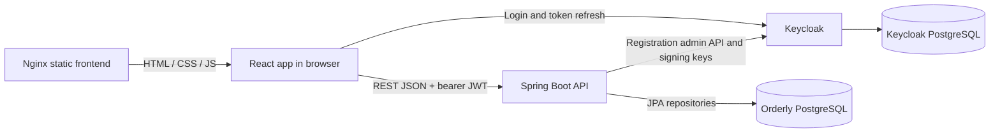
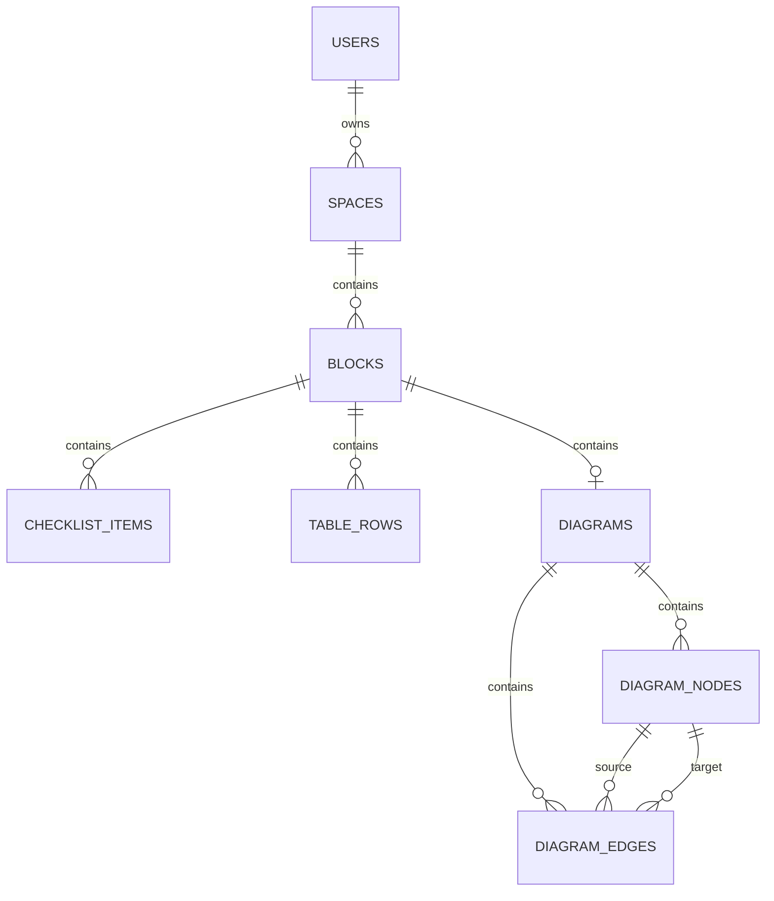

# Orderly baseline and reuse guide

Studied on 5 October 2026. Source revision: `9712560`, plus the current working tree. This is a portable reference for building another app with Orderly's structure and visual language. It describes implemented behavior, then separates limitations from patterns worth reusing. No private `.env` values are included.

## How to use this in another project

Copy this file into the new project and ask:

> Read ORDERLY_BASELINE.md. Use Orderly's warm visual design, account/dashboard/detail-page structure, reusable content cards, and layered frontend/API/database architecture as the baseline. Adapt the domain and features to my new requirements. Preserve the interaction patterns where appropriate, and address the documented implementation gaps rather than reproducing them.

For the closest visual match, also bring `frontend/src/styles.css` and, if useful, `frontend/src/App.jsx` as reference material. This file is self-contained enough to guide a fresh implementation when the original repository is unavailable.

## Product and navigation

Orderly is a personal organization app. A user owns spaces; each space contains ordered blocks; each block is a checklist, a task table, or a diagram. The primary journey is account creation or login, then a spaces dashboard, then a workspace with editable content blocks.

| Screen | Route | Main content and actions |
| --- | --- | --- |
| Registration | `/` or `/index.html` | Product introduction, three feature chips, email, username, password and confirmation; register; link to login |
| Login | `/login.html` | Compact centered card; email/username and password; link to registration |
| Dashboard | `/dashboard.html` | Shared top bar, current username, space search, create/edit form, three-column space cards |
| Workspace | `/project.html?id=<spaceId>` | Shared top bar, back button, space title/description, add-block form, ordered grid of blocks |

The shared top bar contains the Orderly brand button, username, Dashboard, and Log out. There is no sidebar, settings screen, profile editor, or nested navigation hierarchy.

Registration validates email (maximum 255 characters), username (3–100 characters; letters, numbers, dots, underscores and hyphens), password (8–100 characters), and matching confirmation. Success creates an account, logs in, loads the local user, and opens the dashboard. Login and registration show busy button labels and error messages.

### Spaces

- Create and edit a name, description, icon text, and color.
- Search locally by combined name and description, without case sensitivity.
- List spaces newest first; each card has a color strip, icon text badge, name, description, and Open/Edit/Delete buttons.
- Editing reuses the form above the cards, with Save and Cancel.
- Space deletion uses a browser confirmation; child records are deleted through database cascades.
- The icon field renders literal text; it is not an icon-library picker. New spaces default to `folder` and `#2563eb`.

### Blocks

- Add one of three types: checklist, table, diagram.
- Each block has a type label, title, Edit name, Convert menu, and Delete.
- Rename inline in the card header, with Save/Cancel.
- Drag a header to reorder cards. This updates integer `position`; it does not freely position or resize the card.
- Cards occupy a two-column grid on desktop; diagrams span both columns.
- The Convert menu offers the other two block types. It creates another block immediately after the source and retains the source.
- Block and item deletion are immediate in the UI, without the space-level confirmation or an undo feature.

### Checklist options

Add, edit, delete, and check/uncheck text items. Checked items become muted and struck through. The same inline form supports both adding and editing. Items have stored positions, but there is no item drag-reordering control.

### Task table options

Each row contains title, status, priority, optional due date, and Edit/Delete actions.

| Field | Options and display |
| --- | --- |
| Status | `todo`, `pending`, `done`; defaults to `todo` |
| Priority | `low`, `medium`, `high`; frontend defaults to `low` |
| Due date | Native date input; today or later on submission; displayed as `DD.MM.YYYY` |
| Badges | Teal for done/low/upcoming, plum for pending/medium, amber for todo/high/today, rose for past due |

Past dates can still appear as existing rows age. The UI displays `no date` when absent. This is a fixed task schema, not a spreadsheet or a user-defined column system. No sorting controls, row search, filters, pagination, reminders, or calendar view are implemented.

### Diagram options

The editor is custom React/HTML/SVG. It does not use a diagram library.

- Node label, shape, and border color are editable. New nodes are 150 × 76 pixels and placed with a 28-pixel incremental offset.
- Sixteen shape choices: `task`, `note`, `milestone`, `process`, `document`, `database`, `input`, `output`, `terminator`, `card`, `capsule`, `stamp`, `flag`, `wave`, `portal`, `burst`.
- Shapes are CSS treatments: rounded rectangles, pill shapes, asymmetric cards, dashed borders, skewed input/output shapes, and rounded database/portal shapes.
- Select a node to edit it. Click two distinct nodes in order and use Connect or Enter to add an edge from the first to the second.
- Ten edge choices: `arrow`, `curved`, `elbow`, `dashed`, `dotted`, `dash-dot`, `bold`, `soft`, `double`, `plain`.
- Edge label and type can be saved after selecting an edge. `double` has arrowheads at both ends; `plain` has no arrowhead.
- Delete a selected node or edge with toolbar buttons. Backspace deletes the selected edge while focus is outside text inputs. Clicking blank canvas or Clear resets selection/forms.
- Drag nodes with pointer events; edges redraw during dragging; final coordinates are persisted through a PATCH request.
- The canvas starts at 900 × 470 pixels and expands to encompass nodes plus 180 pixels of padding. Its frame scrolls and has a 620-pixel maximum height.
- Edges use calculated rectangle-boundary attachment points, straight paths, quadratic curves, or elbow paths. Attachment geometry is based on rectangular bounds even for decorative shapes.
- No visible zoom, pan-tool, node-resize handles, minimap, export, snapping, undo/redo, or collaborative editing is implemented. Stored viewport/zoom fields are not wired to the UI.
- Although selected edges are stored as a Set, clicking an edge replaces the selection with that one edge; no multiple-edge selection gesture is implemented.

### Conversion behavior

Conversion runs in a backend transaction, shifts later block positions, creates a target titled `<source title> - <target type>`, and copies/transforms content.

| Source → target | Transformation |
| --- | --- |
| Checklist → table | Text becomes title; checked becomes `done`, otherwise `todo`; priority/date absent |
| Table → checklist | Title becomes text; only `done` becomes checked |
| Checklist → diagram | Vertically arranged nodes; teal if checked, amber otherwise; source/check state stored in node metadata |
| Table → diagram | Vertically arranged nodes; color follows status; status, priority and due date stored in node metadata |
| Diagram → checklist | Node labels become unchecked items; edges are not represented |
| Diagram → table | Node labels become rows with `todo`; no priority/date reconstruction |

The API also accepts same-type conversion even though the UI hides it. Same-type diagram conversion copies nodes but does not copy edges. Conversions are snapshots; subsequent edits are not synchronized between source and target. Metadata stored in diagram nodes is not used to restore original task fields on conversion back.

## Visual specification

The visual identity uses a warm pastel background, translucent cream surfaces, amber primary actions, teal secondary accents, brown typography, and soft broad shadows. Most controls and cards have modest 8-pixel corners. Status chips are pill-shaped. Use spacious card composition with visible, directly accessible forms.

| Token | Value |
| --- | --- |
| Base background | `#fff7ed` |
| Primary text / `--ink` | `#201a17` |
| Muted text | `#74655c` |
| Border / `--line` | `rgba(111, 78, 55, 0.18)` |
| Surface | `rgba(255, 252, 247, 0.82)` |
| Strong surface | `rgba(255, 252, 247, 0.95)` |
| Primary / `--brand` | `#b45309` |
| Dark primary | `#8a3d08` |
| Secondary accent | `#0f766e` |
| Soft accent | `#ccfbf1` |
| Plum | `#7c2d5a` |
| Danger | `#b4233c` |
| Soft danger | `#ffe4e6` |
| Normal shadow | `0 22px 54px rgba(94, 49, 17, 0.12)` |
| Strong shadow | `0 28px 72px rgba(65, 38, 23, 0.18)` |

The body combines a 135-degree translucent cream/amber/mint/pink gradient with very subtle horizontal and vertical grid lines at 84-pixel intervals. Cards and top bar use roughly 18-pixel backdrop blur. The diagram canvas uses a finer 34-pixel grid.

Typography is `Inter, ui-sans-serif, system-ui, -apple-system, BlinkMacSystemFont, "Segoe UI", sans-serif`. Inter is named but no font asset or font import is provided, so the installed/system fallback matters. Labels and buttons are bold (typically 800); badges and type labels often use 900. The registration headline is 4rem with line-height 1, becoming 2.6rem on narrow layouts. Eyebrows and block-type labels use uppercase letter spacing.

| Element | Dimensions and spacing |
| --- | --- |
| Registration layout | Maximum 1120px; flexible marketing column + 420px form; 48px gap; vertically centered |
| Login card layout | Centered 320–460px column |
| Top bar | Sticky; minimum 64px high; 24px horizontal padding |
| Main page | Maximum 1440px; desktop width `calc(100% - 40px)`; 28px top, 48px bottom spacing |
| Panels | 18px × 20px padding; 20px bottom spacing |
| Space grid | Three equal columns; 18px gap; cards minimum 240px tall; 5px colored top border |
| Block grid | Two columns, each minimum 460px; 22px gap; diagrams full width |
| Block card | Minimum 240px high; header 14px × 16px; body 16px |
| Forms | Common 12px gap; labeled inputs above values; 40px minimum input height |
| Buttons | 40px minimum; small buttons 32px; icon-only buttons 34px wide |
| Motion | 140ms transitions; buttons lift 1px, space cards lift 2px on hover |

Primary buttons use an amber gradient and white/cream text. Secondary buttons use translucent white with teal text/borders. Convert has a stronger teal gradient. Danger actions use rose text and pale rose hover states. Focused inputs get an amber border and 3-pixel halo. Dragged blocks fade to 0.48 opacity; drop targets get an amber outline/shadow.

At `max-width: 980px`, grids and main forms switch to one column, top bar/header groups stack, task rows stack, and page side margins shrink to 12px. The diagram retains a scrollable minimum-width canvas. These are code-defined responsive rules, not a verified mobile UX assessment.

## Architecture and runtime flow

### Frontend

- React 18.3.x, Vite 5.4.x, plain JavaScript/JSX, handwritten CSS. Dependencies are React and React DOM; no component kit, router package, global state library, form library, or canvas library.
- Four HTML entry points load the same `src/main.jsx`, which renders App in React StrictMode.
- `App.jsx` contains the screens, shared elements, block editors, and geometry helpers in one approximately 1,145-line file.
- Routing uses `window.location`, `history.pushState`, and `popstate`; project ID is a query parameter.
- Component state uses `useState`, effects, and refs. Parent callbacks reload data after mutations.
- `src/services/api.js` centralizes fetch, authentication, token refresh, and resource-specific request functions.
- Full workspace fetch returns `{ space, blocks: [{ block, content }] }`. Checklist/table content is an array; diagram content is `{ diagram, nodes, edges }` or null.
- Most mutations await a request and refetch the whole space; reordering optimistically changes local order and sends a separate PATCH for every block. There is no query cache, websocket, background synchronization, or offline data store in the active flow.
- `projectStore.js` and `data/projects.xml` are remnants of an older local-storage/XML app and are not imported by the active React entry path. Business data now comes from the API; localStorage holds authentication tokens.

### Backend

Java 21, Spring Boot 3.3.5, Maven, Spring Web, Spring Data JPA, Bean Validation, Spring Security OAuth2 resource server, Flyway, PostgreSQL, Springdoc OpenAPI 2.6.0.

The package layout is controller → service → repository/entity, with separate DTO, config, security, exception, and auth packages. Controllers map HTTP and create-request validation; transactional services implement operations and business validation; JPA repositories handle queries; `DtoMapper` separates persistence objects from responses. `BlockFullService` and `BlockContentService` assemble nested workspace content; `BlockConversionService` handles type conversion.

Updates often modify managed entities inside a transaction and rely on JPA dirty checking. Relationships are lazy; Open Session in View is disabled. Flyway owns schema changes and Hibernate validates the resulting schema (`ddl-auto: validate`). Base entities supply generated numeric IDs and created/updated timestamps.

Structured application errors contain `timestamp`, `status`, `error`, `message`, and `fields`. Validation failures expose field messages; missing records and business rules use `ApiException`. Frontend fetch maps responses to errors with message, status, and data. Not every frontend mutation catches and displays its error.

### Authentication details

1. Registration posts to public `/api/auth/register`.
2. The backend obtains a Keycloak admin token, creates the account, sets its password, marks email verified, and creates the local user row. There is no email-confirmation workflow in this implementation.
3. The app's login form posts directly to Keycloak's token endpoint using the password grant and public client `orderly-frontend`. Swagger uses a separate authorization-code-with-PKCE login flow.
4. Access and refresh tokens are stored in localStorage. API calls attach a bearer token.
5. A shared promise prevents simultaneous refresh requests. Tokens are refreshed within 30 seconds of expiry, with a 60-second keep-alive check and checks on focus/visibility changes. An API 401 triggers one refresh/retry.
6. Refresh failure clears tokens and signals `orderly:auth-expired`; the app navigates to login. Log out clears local tokens; it does not call Keycloak logout/revocation.
7. The backend validates JWTs using a configured issuer and signing-key endpoint. Realm roles and scopes are mapped to authorities, but no role-specific UI or resource method restrictions are present.
8. `/api/users/me` finds or automatically provisions/links a local user from token identity/email. Despite a helper named `ensureLocalUser`, the active screens call `getCurrentUser` directly and provisioning happens in the backend.

`/api/**` requires authentication except public registration. Swagger/OpenAPI and OPTIONS are public. Email-verification enforcement is configurable and defaults to false in both Compose and application configuration. Actual private environment overrides were not reviewed.

## Data model

| Table | Important fields |
| --- | --- |
| users | Unique email, username, non-null unique keycloak_id; no password hash in current schema |
| spaces | owner_id, name, description, icon, color |
| blocks | space_id, type, title, position, x, y, width, height |
| checklist_items | block_id, text, is_done, position |
| table_rows | block_id, title, status, priority, due_date, position |
| diagrams | Unique block_id, viewport_x, viewport_y, zoom |
| diagram_nodes | diagram_id, type, label, x/y, width/height, JSONB style_json/data_json |
| diagram_edges | diagram_id, source_node_id, target_node_id, label, type, JSONB style_json |

All have IDs and created/updated timestamps. Foreign keys cascade deletions down the hierarchy; node deletion also removes attached edges. Parent IDs are indexed. Database checks constrain block types, table statuses, and self-referencing edges. Service validation additionally checks content/block compatibility, positive node dimensions, same-diagram edge endpoints, and due dates.

JSON metadata is represented as strings in the DTOs and parsed/stringified in the browser, while stored in PostgreSQL JSONB. Block geometry and diagram viewport geometry are persisted but unused by the current workspace layout.

Migrations: V1 creates schema; V2 seeds demo content; V3 adds auth-provider uniqueness; V4 renames identity to keycloak_id and drops password_hash; V5 aligns demo identity; V6 adds block layout geometry.

## API surface

All paths below have `/api` prefix. POST generally returns 201 for creation; DELETE returns 204. PATCH applies supplied non-null values.

| Resource | Routes |
| --- | --- |
| Registration | `POST /auth/register` |
| Users | `POST /users`, `GET /users/me`, `GET/PATCH/DELETE /users/{id}` |
| Spaces | `GET/POST /spaces`, `GET/PATCH/DELETE /spaces/{id}`, `GET /spaces/{id}/full` |
| Blocks | `GET/POST /spaces/{id}/blocks`, `GET/PATCH/DELETE /blocks/{id}`, `GET /blocks/{id}/full` |
| Conversions | `POST /blocks/{id}/convert/checklist`, `/table`, `/diagram` |
| Checklist | `GET/POST /blocks/{id}/checklist-items`, `PATCH/DELETE /checklist-items/{id}` |
| Task table | `GET/POST /blocks/{id}/table-rows`, `PATCH/DELETE /table-rows/{id}` |
| Diagram | `GET/POST /blocks/{id}/diagram`, `PATCH/DELETE /diagrams/{id}` |
| Nodes | `GET/POST /diagrams/{id}/nodes`, `PATCH/DELETE /diagram-nodes/{id}` |
| Edges | `GET/POST /diagrams/{id}/edges`, `PATCH/DELETE /diagram-edges/{id}` |

## Deployment and configuration

Compose defines five core services: frontend, backend, Orderly PostgreSQL, Keycloak, and Keycloak PostgreSQL. Optional pgAdmin uses the `tools` profile. Database volumes persist independently of containers. Health checks gate startup dependencies.

| Service | Repository image/build | Default host port |
| --- | --- | --- |
| Frontend | Node 22 Alpine build → Nginx 1.27 Alpine | 5173 → 80 |
| API | Maven 3.9.11 / Java 21 build → Temurin 21 JRE Alpine | 8080 |
| Orderly database | PostgreSQL 16 Alpine | localhost-only 5433 → 5432 |
| Keycloak | 26.2.5, `start-dev --import-realm` | 8081 → 8080 |
| Keycloak database | PostgreSQL 16 Alpine | Not published |
| pgAdmin | pgAdmin 4 version 8 | localhost-only 5050 → 80 |

The browser calls backend and Keycloak directly on separate origins; Nginx serves frontend assets and `/health`, without proxying API requests. `PUBLIC_HOST` and service ports generate browser URLs, JWT issuer, CORS origins, and Swagger callback URLs. Vite URLs are build-time arguments, so host changes require a frontend rebuild. Keycloak signing-key and admin requests use container-internal addresses from the API.

Configuration categories: public host/ports; app database credentials; Keycloak database/admin/realm/client settings; issuer/JWK URLs; allowed CORS origins; email-verification toggle. Some `.env.example` entries duplicate values generated directly in Compose; changing a standalone variable is not necessarily sufficient to override Compose's generated URL.

PowerShell scripts provide start/build/readiness checks, stop while preserving volumes, destructive volume reset, server-address discovery, and remote-host configuration. Remote configuration validates a hostname/IPv4, edits PUBLIC_HOST, rebuilds services, and merges localhost/new-host redirects and origins into the existing Keycloak client. It supports private LAN/Tailscale use. The root README explicitly scopes deployment to local/private access.

## Reuse decisions and implementation gaps

Preserve the warm palette, translucent cards, bold labels, clear actions, account/dashboard/detail-page flow, shared app shell, inline editing, reusable block headers, status badges, and consistent service/API boundaries. Adapt entities and forms to the next app's actual domain; a similar baseline does not require reusing every Orderly feature.

The following findings are from source inspection, not live exploit tests or a complete security audit:

| Finding | Evidence and implication for reuse |
| --- | --- |
| Missing resource ownership enforcement | Space listing is filtered by current owner, but individual space reads/updates/deletes and child-resource operations use IDs without comparing ownership. User-by-ID routes are also unrestricted beyond authentication. Add ownership checks throughout the parent chain and cross-user tests. |
| Identity linking and verification shortcuts | Registration marks emails verified; verification enforcement defaults off; automatic email matching can overwrite an existing local user's keycloak_id. Review these behaviors before adopting a multi-user account model. |
| Broad registration credentials and partial failure | Registration uses Keycloak admin credentials and several remote calls before saving the local user. There is no compensation if a later step fails. Design the required account permissions and recovery flow explicitly. |
| Frontend authentication choices | Password-grant login, localStorage tokens, and local-only logout are current implementation facts. Select the next app's authentication flow deliberately rather than copying these incidentally. |
| Monolithic frontend | Screen/editor separation would make extension easier; retain shared styles and interaction contracts while extracting modules. |
| Reordering and data loading | One PATCH per block can partially succeed; full-space refetches and per-block content queries grow with workspace size. Consider an atomic reorder endpoint and more targeted data updates if scale warrants them. |
| Null cannot clear some optional fields | Table PATCH ignores null dueDate. Clearing the frontend date produces null and leaves an existing date unchanged. Define omitted versus explicit-null semantics. |
| Date rules | Editing an overdue row through the UI requires changing or clearing the date; browser-local today and server-local today may differ. Choose the intended date policy for the new domain. |
| Inconsistent validation/error handling | Some PATCH DTOs lack create-equivalent validation, priorities are not server-enumerated, and several UI mutation failures are not displayed. Node drag failure is swallowed in one path. |
| Responsiveness and accessibility need runtime review | Fixed table-column/form widths inside half-width blocks may overflow; the block card clips overflow; drag reordering has no keyboard alternative; several controls only have placeholders. Do not treat CSS breakpoints as proof of mobile/accessibility quality. |
| Conversion limitations | Converted copies lose fields that have no target representation; diagram edges are not copied by same-type conversion; round trips do not restore metadata. Keep the documented copy behavior or explicitly redesign it. |
| Backend-only capabilities | Do not promise free block layout, resizing, or diagram zoom solely because fields exist in the database/API. |

No active implementation was found for teams/sharing, invitations, real-time collaboration, file attachments, notifications, payments, admin dashboard, themes, import/export, offline sync, or version history. Keycloak realm settings allow password reset, but the custom login screen does not expose a reset link.

## Verification and documentation accuracy

- Source review covered active frontend screens/styles/services, backend controllers and core services, authentication/security, schema/DTOs, migrations, tests, container definitions, and operating scripts.
- Frontend production build passed using installed dependencies: Vite 5.4.21, 35 modules transformed.
- Backend tests passed with `mvn.cmd -o test`: 37 tests, zero failures, zero errors, zero skipped.
- No live screenshots or end-to-end interaction verification: no browser was connected to the available browser tool, and localhost ports 5173/8080/8081 timed out from this session. Design observations are derived from JSX/CSS.
- Existing tests comprise 12 Java test classes and 37 `@Test` methods covering selected services, controllers, registration, identity, and email-verification behavior. Controller tests inspected disable security filters; they do not establish end-to-end authorization coverage. No frontend test command is configured. The Docker backend build skips tests.
- `frontend/README.md` incorrectly describes mock authentication and XML/localStorage business data. `backend/README.md` incorrectly describes `/users/me` as requiring explicit provisioning first and verified-email enforcement as the default. It also includes older auth-profile and fixed-callback instructions. Prefer current code/Compose when these disagree.
- The user's pre-existing `.env` modification was preserved. No application source or configuration was changed for this study.

## Source map

| Concern | Primary files |
| --- | --- |
| Screens and interactions | `frontend/src/App.jsx` |
| Visual tokens and layouts | `frontend/src/styles.css` |
| HTTP/auth/session behavior | `frontend/src/services/api.js` |
| React entry and build routing | `frontend/src/main.jsx`, `frontend/vite.config.js`, four frontend HTML files |
| Request contracts | `backend/src/main/java/com/orderly/backend/dto/` and `controller/` |
| Business rules and conversions | `backend/src/main/java/com/orderly/backend/service/` |
| Registration | `backend/src/main/java/com/orderly/backend/auth/` |
| Access configuration and identity | `backend/src/main/java/com/orderly/backend/config/`, `security/` |
| Persistence | `backend/src/main/java/com/orderly/backend/entity/`, `repository/`, `backend/src/main/resources/db/migration/` |
| Runtime | `compose.yaml`, both Dockerfiles, `frontend/nginx.conf`, `backend/src/main/resources/application.yml` |
| Environment and local operations | `.env.example`, `scripts/`, `backend/keycloak/orderly-realm.json` |
| Existing test coverage | `backend/src/test/java/com/orderly/backend/` |
