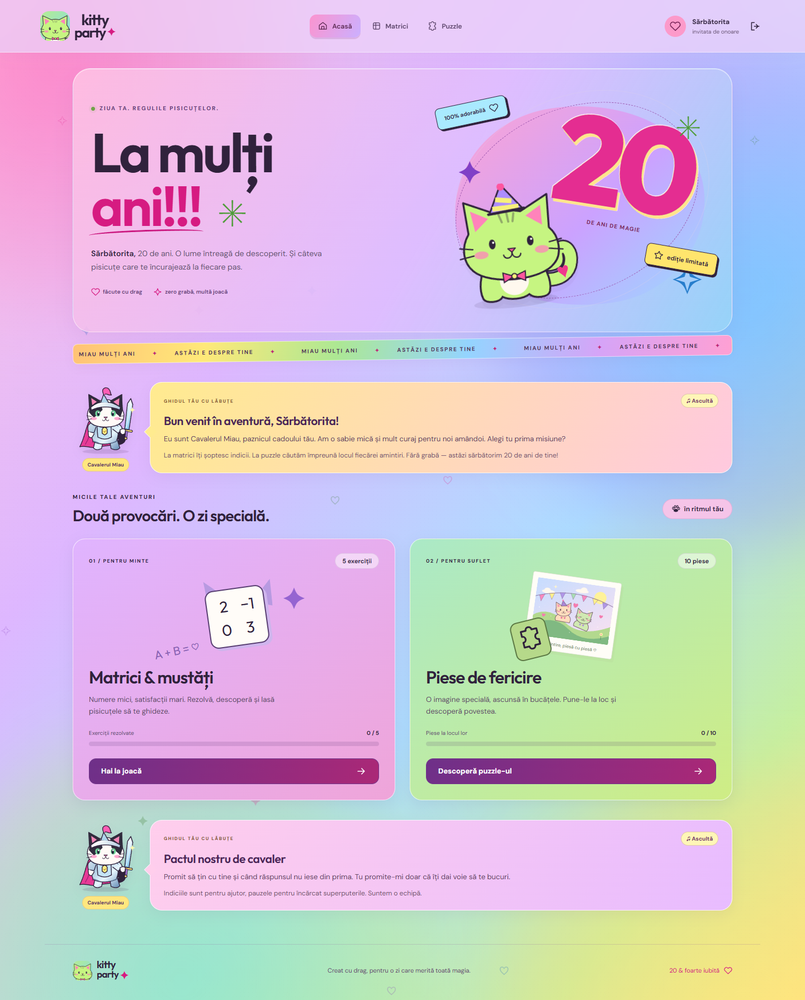

# Kitty Party ✦ La mulți ani, 20!

O aplicație aniversară în română, cu Cavalerul Miau, pisicuțe animate, exerciții de matrice și un puzzle din fotografia aleasă de organizator. Două conturi, progres separat și un atelier privat de administrare.



[Previzualizare pe telefon](docs/home-mobile.png) · [Autentificare](docs/login-desktop.png)

## Pornire rapidă

Ai nevoie de **Node.js 24 sau mai nou**. Din folderul proiectului:

```powershell
npm ci
npm run build
npm start
```

La prima instalare, deschide **http://localhost:3001**. Dacă ai ales altă adresă, folosește URL-ul afișat în consolă sau `npm run addresses`. În Windows poți folosi și `./scripts/start-app.ps1`.

Pentru dezvoltare, `npm run dev` pornește API-ul pe 3001 și Vite pe portul **5174**, pe adresa configurată, cu actualizare automată. Frontend-ul folosește un proxy local pentru API și imagini. Fonturile sunt incluse local; nu există cereri către Google Fonts.

## Cele două conturi și parolele

La prima pornire, aplicația generează automat **config/accounts.json**, cu parole aleatoare diferite. Poți genera fișierul și înainte de pornire:

```powershell
npm run accounts
```

Deschide **config/accounts.json** în editor. Acolo vezi și modifici numele de utilizator, parola și numele afișat pentru fiecare cont:

| Identificator stabil | Utilizator inițial | Rol                                            |
| -------------------- | ------------------ | ---------------------------------------------- |
| admin                | admin              | Administrator; poate testa și ambele provocări |
| birthday             | sarbatorita        | Contul invitatei                               |

Păstrează identificatorii `admin` / `birthday` și câte un rol `admin` / `player`. Parolele trebuie să aibă 10–128 de caractere. **Repornește serverul după modificări.** Schimbarea unei parole invalidează sesiunile acelui cont, fără să-i șteargă progresul. Nu există pagină sau API de înregistrare.

`config/accounts.example.json` explică structura și nu este folosit ca sursă a parolelor reale. Fișierul real, baza de date și fotografiile sunt excluse din Git. Parolele în clar există în fișierul local solicitat pentru configurare; baza de date păstrează hash-uri scrypt cu salt. Protejează accesul la folderul local și nu publica acest fișier.

## Pregătește cadoul

1. Intră ca administrator și deschide **Atelier → Petrecerea**.
2. Personalizează numele sărbătoritei și mesajul de pe prima pagină.
3. Alege dificultatea matricelor și salvează.
4. Încarcă o fotografie JPEG, PNG sau WebP. Imaginea de pornire este o ilustrație originală cu pisicuțe, pentru probă.
5. Alege **10, 100, 200 sau 500 de piese** și salvează.
6. Opțional, adaugă exerciții în **Atelier → Exercițiile**. Soluția este calculată automat înainte de adăugare.
7. Verifică progresul separat al celor două conturi în **Atelier → Progresul**.

O fotografie nouă sau alt număr de piese creează un puzzle nou pentru ambele conturi. Modificarea dificultății și a exercițiilor se aplică **seturilor noi**; un set deja început rămâne intact. Apasă „Vreau un set nou” în pagina Matrici pentru a-l înlocui, după confirmare.

## Ordinea aventurii

Pentru contul invitatei, **matricile se termină înainte de puzzle**, inclusiv exercițiile personalizate din setul început. Indiciile și soluțiile pot ajuta, dar fiecare exercițiu trebuie trimis cu răspuns corect. Pagina Acasă păstrează fotografia-surpriză ascunsă și arată drumul spre matrici. După ultimul răspuns corect apare butonul **Spre puzzle**.

Administratorul poate testa oricare provocare, în orice ordine. Blocarea este verificată pe server pentru pagina puzzle-ului, salvare, resetare și fotografiile încărcate. Deblocarea este păstrată în SQLite: un set nou de matrici nu închide din nou puzzle-ul și nu șterge piesele puse. Seturile terminate înainte de această actualizare sunt recunoscute automat.

## Matrici & mustăți

- **Pui de pisică:** 5 exerciții, cu adunare, înmulțire cu scalar, transpusă, determinant și inversă simplă 2 × 2.
- **Pisică isteață:** 7 exerciții; adaugă scădere și produs de matrice, iar inversele pot avea fracții.
- **Super pisică:** 9 exerciții, inclusiv determinant și inversă 3 × 3.
- Matrice de maximum 3 × 3, numere generate între −3 și 3; inversele generate sunt nesingulare. Exercițiile personalizate acceptă întregi între −9 și 9.
- Căsuțe interactive, verificare pe fiecare element, indicii și soluții explicate. Sunt acceptate `1/2`, `0.5` și `0,5`.
- Până la 20 de exerciții personalizate, adăugate după cele generate.
- Consultarea unei soluții este înregistrată, fără penalizare. Un exercițiu se consideră rezolvat după trimiterea unui răspuns corect.
- Progresul, încercările, indiciile și soluțiile consultate sunt păstrate pe server. Un nou set generează alte numere și înlocuiește progresul setului precedent.

## Piese de fericire

- Piese SVG cu contururi complementare, generate din imagine; număr exact de piese, adaptând rândurile și coloanele la orientarea fotografiei.
- Proporțiile fotografiei sunt păstrate; piesele pot fi dreptunghiulare, mai ales la setul de 10.
- Trage o piesă sau selecteaz-o și apasă pe locul ei. Piesa se fixează numai în poziția corectă.
- Cu tastatura: Tab / Enter pentru piesă și locul de pe tablă.
- Zoom 50–300%, model suprapus, indiciu pentru piesa selectată și amestecarea cutiei. Dacă locul sugerat este în afara zonei vizibile la zoom, indiciul deplasează tabla spre el. **Potrivește pe ecran** readuce întreaga tablă în zona vizibilă.
- Tabla are scroll propriu; cutia cu piese rămâne alături pe desktop și landscape, iar pe telefonul ținut vertical stă în partea de jos. Căutarea și așezarea pieselor nu mai necesită alternarea între zone îndepărtate ale paginii.
- **Ecran complet** păstrează numai tabla, piesele și comenzile. Poți afișa ghidul la cerere și folosi **Ascultă / Oprește**, inclusiv playerul de rezervă pe telefon. Ieși cu butonul ✕ sau Escape; progresul și selecția sunt păstrate. Există și un mod care ocupă fereastra când browserul nu permite Fullscreen API.
- Pe telefon, aplicația încearcă orientarea landscape după intrarea în fullscreen. [Blocarea orientării depinde de browser și dispozitiv](https://developer.mozilla.org/en-US/docs/Web/API/ScreenOrientation/lock); dacă nu este permisă, poți roti manual telefonul și interfața se adaptează. Selectează o piesă și atinge locul ei, sau trage în direcția tablei. Cutia se poate derula independent de tablă.
- Cutie paginată cu 24 de piese: varianta de 500 nu afișează toate miniaturile simultan.
- Salvare automată pe server; progresul revine după reîncărcare sau conectare de pe alt dispozitiv. Dacă salvarea eșuează, un mesaj oferă reîncercarea.
- Fotografiile se optimizează în browser la maximum 2000 px și sunt servite numai utilizatorilor conectați. Originalul poate avea maximum 20 MB; serverul acceptă până la 8 MB pentru fișierul optimizat.

[Fullscreen pe desktop](docs/puzzle-fullscreen-desktop.png) · [Pe telefon](docs/puzzle-fullscreen-phone.png) · [Landscape](docs/puzzle-fullscreen-landscape.png)

## Sortează piesele înainte de joacă

În pagina Puzzle, apasă **Sortează piesele** sau pictograma de lângă filtrul cutiei. Interfața este disponibilă ambelor conturi, în modul obișnuit și în fullscreen. Contul invitatei are acces după deblocarea puzzle-ului prin matrici.

- Începi cu **Colțuri**, **Margini** și **Interior**. Selectează una sau mai multe piese și apasă **Mută aici** în categoria dorită. Pe calculator, poți trage o piesă sau selecția întreagă într-o cutie. Pe telefon, atinge piesele și apoi butonul de mutare.
- Creează categorii personale, de exemplu „Cer”, „Blăniță” sau „Flori”, cu un nume și o culoare. Le poți redenumi sau șterge; piesele unei categorii șterse devin nesortate. Sunt permise până la **24 de categorii**, cu nume distincte de maximum 40 de caractere.
- **După contur** separă colțurile, marginile și piesele interioare după orientarea proeminențelor. Nu așază piesele pe tablă.
- **După culoare** analizează local în browser fotografia și grupează piesele după culoarea dominantă, inclusiv categorii pentru culori deschise, închise și mixte. Rezultatul este orientativ; poți muta manual orice piesă. Fotografia nu este trimisă unui serviciu de analiză.
- Sortarea automată cere confirmare dacă înlocuiește o organizare existentă. **Anulează ultima sortare** permite întoarcerea până la 20 de modificări din sesiunea curentă a paginii, inclusiv mutări și editări de categorii. **Scoate din categorii** golește asocierile și păstrează cutiile și piesele puse pe tablă.
- **Înapoi la puzzle** păstrează sortarea. Filtrul din cutia cu piese permite alegerea unei categorii, a pieselor nesortate sau a tuturor pieselor rămase. Piesele așezate dispar automat din liste și din numărul categoriei.

Organizarea este salvată automat în SQLite **separat pentru fiecare cont și versiune de puzzle** și revine la reîncărcare sau pe alt dispozitiv. „De la început” resetează așezarea pe tablă, păstrând cutiile și asocierile. O fotografie nouă sau alt număr de piese începe cu o organizare nouă. Dacă două ferestre ale aceluiași cont încearcă să salveze sortări diferite, apare **Reîncarcă sortarea**, pentru a evita suprascrierea fără avertizare. O eroare de conexiune oferă reîncercarea salvării.

[Sortare pe desktop](docs/puzzle-sorting-desktop.png) · [Pe telefon](docs/puzzle-sorting-phone.png) · [Companionul cu voce în fullscreen](docs/puzzle-companion-voice.png)

## Cavalerul Miau

Un pisoi alb-negru în armură, cu pelerină magenta și sabie, te însoțește de la autentificare la ultima piesă. Ilustrația SVG este originală: clipește, respiră, mișcă pelerina și ridică sabia la reușite. Bulele lui conțin indicii reale, explicațiile soluțiilor și încurajări după încercări.

Butonul **Ascultă** redă vocea numai la cerere. Cavalerul se animă în timpul redării și poate folosi înregistrări încărcate, audio generat sau vocea română a dispozitivului. O singură bulă a ghidului vorbește la un moment dat; schimbarea paginii sau a replicii oprește redarea. Mesajele rămân mereu disponibile în scris.

## Adaugă ușor o voce

Deschide **Atelier → Vocea**. Varianta inițială, **Înregistrări + vocea browserului**, funcționează fără cheie API.

### Înregistrări, fără servicii externe

1. La **Adaugă o replică audio**, alege replica din listă sau scrie textul exact afișat în bula cavalerului.
2. Dă-i un nume și apasă **Încarcă audio**: MP3, WAV, OGG sau M4A, maximum **15 MB**. Poate fi vocea ta, o înregistrare pregătită sau un audio generat în altă aplicație.
3. Apasă **Ascultă** în probă. Audio-ul este salvat imediat și se poate reda pe calculator și telefon, inclusiv când lipsește o voce română instalată.

Asocierea folosește textul principal al bulei, cu spațiile normalizate. Fișierul trebuie să conțină acea replică; aplicația nu transcrie înregistrarea. Încărcarea unui alt audio pentru același text îl înlocuiește. Dacă modifici replica în editorul de texte, înregistrarea veche apare ca **Text modificat** și trebuie refăcută pentru textul nou. Titlul și detaliile suplimentare nu sunt citite automat de un fișier înregistrat. Pentru indicii cu numere diferite, folosește generarea dinamică sau o înregistrare pentru combinația exactă.

Biblioteca are player și ștergere pentru fiecare înregistrare. Pe telefoanele care blochează pornirea audio după cererea către server, cavalerul afișează un player: apasă redare acolo. Compatibilitatea codec-ului depinde de browser; MP3 sau WAV PCM sunt variante simple pentru compatibilitate largă.

### Generare dinamică prin ElevenLabs, opțională

1. Adaugă cheia API în **Atelier → Vocea** și salvează. Cheia rămâne pe server, în fișierul local ignorat de Git.
2. Apasă **Încarcă vocile din cont** și alege o voce; poți introduce și **Voice ID** direct. Salvează selecția.
3. Alege **Înregistrări + generare ElevenLabs**, apoi salvează și încearcă **Ascultă**. Înregistrările potrivite au prioritate; celelalte replici se generează din textul actual, cu titlul și detaliile sale.

Sunt disponibile modelele Multilingual v2 și Flash v2.5, care [acceptă româna](https://elevenlabs.io/docs/overview/models). Poți ajusta stabilitatea, expresivitatea și limita zilnică de caractere. Generarea trimite textul replicii către ElevenLabs și folosește creditele contului tău; aplicația nu activează un abonament și nu are o cheie inclusă. **Generează și păstrează replica** creează explicit o înregistrare reutilizabilă chiar dacă modul dinamic rămâne oprit.

**Un fișier audio încărcat nu clonează vocea pentru texte noi.** Pentru o voce proprie, creează/adaugă vocea în contul ElevenLabs, apoi selecteaz-o aici. Vezi [Voice cloning](https://elevenlabs.io/docs/eleven-api/concepts/voice-cloning) și [cum găsești Voice ID](https://help.elevenlabs.io/hc/en-us/articles/14599760033937-How-do-I-find-the-voice-ID-of-my-voices-via-the-website-and-API). Poți crea acolo un timbru jucăuș pentru cavaler și îl poți folosi la replicile românești.

Replicile identice cu aceeași voce, model și setări sunt refolosite din cache pentru ambele conturi. Limita inițială este **10.000 de caractere pe zi UTC**, pentru cereri noi; cererile trimise sunt contorizate inclusiv dacă serviciul eșuează, pentru a păstra limita conservatoare. Nu reprezintă un raport de facturare ElevenLabs. Există maximum două generări simultane și 20 de cereri noi pe minut per cont. Cache-ul păstrează cel mult 500 de fișiere / 100 MB, eliminând cele mai vechi când depășește limita. **Golește cache-ul audio** păstrează înregistrările încărcate și cele generate explicit pentru bibliotecă.

La lipsa înregistrării sau la o eroare de generare, ghidul încearcă vocea română locală (Web Speech API). Tonalitatea și viteza din atelier ajustează doar această voce; nu transformă timbrul fișierelor audio. Dacă dispozitivul nu are voce română, mesajul rămâne scris.

Fișierele sunt în **data/audio/**; configurația, asocierile, utilizarea și cache-ul sunt în SQLite. Accesul la audio cere o sesiune validă; numai administratorul îl poate încărca, genera pentru bibliotecă, înlocui sau șterge. Audio-ul nu depinde de deblocarea puzzle-ului, astfel încât ghidul să poată vorbi pe parcursul matricelor. Fotografia-surpriză rămâne protejată.

Cheia salvată în atelier se păstrează local, în clar, în **config/voice-secrets.json**, exclus din Git și din imaginile Docker. Protejează accesul la fișier la fel ca pentru conturi. Poți folosi alternativ variabila de mediu **ELEVENLABS_API_KEY**, care are prioritate și se modifică din mediul serverului; **VOICE_SECRETS_FILE** poate indica altă cale locală. Modificările din atelier nu cer repornire; modificarea variabilelor de mediu cere repornirea serverului. Pentru Docker, cheia poate fi pusă în **.env** sau configurată în atelier; fișierul local și audio-ul persistă în volumele existente. Integrarea folosește [API-ul oficial TTS](https://elevenlabs.io/docs/api-reference/text-to-speech/convert) și [catalogul de voci](https://elevenlabs.io/docs/api-reference/voices/search).

[Atelierul pentru voce](docs/voice-admin.png)

## Textele, indiciile și replicile

Deschide **Atelier → Textele**. Catalogul are **308 texte editabile**: autentificare, aniversare, navigare, replicile cavalerului, reacții, butoane, titluri, indicii și explicații. Caută un cuvânt sau alege o categorie. Previzualizarea folosește valori de exemplu.

- Schimbă numele cavalerului; referințele cu `{guide}` se actualizează automat.
- Folosește variabilele afișate sub câmp: `{recipient}`, `{scalar}`, `{determinant}`, `{row}`, `{col}` și celelalte variabile specifice acelui text.
- **Salvează textele** aplică modificările. Câmpurile goale și „Text implicit” revin la varianta originală.
- Exportă/importă textele personalizate în JSON pentru backup sau pregătire offline. Importul intră întâi în editor; se aplică după salvare.
- În **Atelier → Exercițiile**, butonul de editare permite modificarea titlului și indiciului unui exercițiu existent, inclusiv pentru seturi începute. Numerele și progresul rămân intacte. Indiciul personalizat are prioritate față de cel general al operației; un indiciu gol folosește textul general.

Textele sunt salvate în SQLite, fără modificarea codului sau repornirea serverului. Titlurile și indiciile sunt folosite de API la următoarea cerere; textele din alte ferestre se actualizează la reîncărcare sau la revenirea în fereastră. Datele mesajelor de prezentare sunt disponibile înainte de login; conturile, progresul și fotografiile rămân protejate. Textele se afișează ca text simplu, fără HTML executabil. Editorul validează lungimile și variabilele; limita totală este 120 KB. Mesajele tehnice ale administratorului și unele erori de sistem rămân fixe.

[Previzualizarea editorului](docs/text-editor.png)

## Design și arhitectură

React + Vite, CSS propriu, fonturi locale DM Sans / Outfit și ilustrații SVG originale. Fundal aurora animat, panouri intens colorate, magenta, roz, lavandă, verde, albastru și galben; pisicuțe care clipesc și mișcă coada, butoane cu gradient animat, steluțe, bandă aniversară și confetti. Animațiile respectă `prefers-reduced-motion`.

Din Orderly sunt păstrate structura cont → dashboard → provocare, componentele reutilizabile, separarea API-ului și persistența. Pentru o aplicație de două persoane, serverul **Node.js + SQLite** înlocuiește Spring/PostgreSQL/Keycloak și reduce configurarea la un singur proces. Nu este necesar un server extern pentru autentificare sau baze de date.

```text
frontend/src/
  App.jsx                autentificare, navigare, dashboard
  Art.jsx                pisicuțe, iconițe, progres, confetti
  Messages.jsx           catalogul de texte, încărcare publică, context
  TextEditor.jsx         editare, previzualizare, export/import
  Guide.jsx              cavaler SVG, dialog, aurora
  Voice.jsx              redare, cache audio API, fallback și vocea browserului
  VoiceAdmin.jsx         configurare voce, upload și bibliotecă audio
  MathChallenge.jsx      interfața exercițiilor
  PuzzleChallenge.jsx    puzzle, gesturi, zoom, salvare și filtre de categorii
  PuzzleSorter.jsx       cutii personale, selecție multiplă, drag și culori
  Admin.jsx              configurare, fotografii, exerciții, progres
  api.js                 client HTTP și sesiune expirată
  styles.css             componente de bază și responsive
  celebration.css        paleta aniversară, ghid și animații
  puzzle.css             tablă cu dock persistent, fullscreen și landscape
  puzzle-sort.css        sortare responsive și vocea companionului fullscreen
  voice.css              atelierul audio și playerul mobil
server/
  index.mjs              API, sesiuni, SQLite și fișiere statice
  accounts.mjs           generare / validare conturi din fișier
  math.mjs               generare, validare, soluții și verificare
  puzzle.mjs             dimensiunile grilei și validarea progresului
  network.mjs            configurație de adresă și detectare Tailscale
  voice.mjs              înregistrări, ElevenLabs, cache și audio privat
shared/messages.mjs      texte implicite, variabile și validare comună
shared/puzzle-sorting.mjs  categorii, validare, contururi și culori dominante
public/                  ilustrații SVG originale
tests/                   teste matematice și integrare API
scripts/browser-check.mjs  verificări reale în browser, izolate de datele aplicației
```

Sesiunile folosesc cookie-uri HttpOnly, SameSite=Strict, cu expirare la 7 zile. Baza de date păstrează hash-ul tokenului. API-ul verifică rolul pentru toate operațiile administrative și identifică progresul exclusiv din sesiune. Există limitare a încercărilor de autentificare, verificare de origine pentru mutațiile browserului, limite de upload și antete de securitate. Baza de date folosește WAL și foreign keys.

Fișiere persistente:

- `data/kitty.sqlite` — conturi, sesiuni, setări, exerciții, progres și sortarea puzzle-ului.
- `data/uploads/` — fotografii încărcate; imaginile vechi rămân păstrate local.
- `data/audio/` — înregistrări audio și replici generate.
- `config/accounts.json` — configurarea locală a celor două conturi.
- `config/network.json` — adresa și portul acestui calculator; exclus din Git.
- `config/voice-secrets.json` — cheia ElevenLabs, dacă este configurată din atelier; exclusă din Git.

Pentru backup simplu, oprește aplicația și copiază **data/** și **config/** împreună. Nu șterge aceste directoare la actualizarea codului.

## Adrese și Tailscale

Pentru afișarea adreselor localhost, LAN, Tailscale IPv4/IPv6 și MagicDNS:

```powershell
npm run addresses
# Sau, pe Windows:
./scripts/show-addresses.ps1
```

Pentru a folosi adresa Tailscale a calculatorului:

```powershell
npm run configure:network -- --tailscale
npm run build
npm start
```

Tailscale trebuie să fie instalat și conectat. Scriptul detectează IP-ul și salvează **config/network.json**. Serverul ascultă doar pe acel IP; frontend-ul, API-ul și fotografiile folosesc aceeași origine. Configurația funcționează și cu **npm run dev**, unde pagina se deschide pe portul **5174**, iar proxy-ul folosește portul API configurat. Nu sunt necesare schimbări manuale în URL-urile React.

Oprește și repornește serverele după schimbarea adresei. Pe telefonul/laptopul invitatei, conectează Tailscale în aceeași rețea sau acordă-i acces la dispozitiv prin Tailscale; regulile tailnet-ului trebuie să permită accesul. Calculatorul gazdă și aplicația trebuie să rămână pornite. Lista arată adresele calculatorului, fără să deschidă automat toate interfețele.

Alte variante:

```powershell
# Înapoi la localhost:
npm run configure:network -- --local
# Un IP al acestui calculator, cu alt port:
npm run configure:network -- --host 192.168.1.4 --port 3002
# Toate interfețele IPv4 (LAN și Tailscale):
npm run configure:network -- --host 0.0.0.0
# Echivalent Windows; implicit alege Tailscale:
./scripts/configure-address.ps1
./scripts/configure-address.ps1 -Mode local
./scripts/configure-address.ps1 -Mode custom -Address 192.168.1.4 -Port 3002
```

Adresa LAN din exemple trebuie înlocuită cu cea afișată pe calculatorul tău. `HOST` / `PORT` din mediul procesului au prioritate față de fișier. Pe un calculator nou, rulează din nou configurarea Tailscale. Datele personale și progresul nu se modifică.

Accesul direct folosește HTTP pe adresa privată Tailscale. Dacă vrei un URL HTTPS privat, [Tailscale Serve](https://tailscale.com/docs/features/tailscale-serve) poate face proxy către aplicație: configurează întâi localhost, pornește aplicația, apoi `tailscale serve --bg http://127.0.0.1:3001`. Această variantă este opțională și scripturile nu modifică setările Serve/Funnel existente. Pentru HTTPS poți seta `COOKIE_SECURE=true`; pentru adresa HTTP directă lasă `COOKIE_SECURE=false`.

## Docker

```powershell
docker compose up --build -d
```

Aceleași directoare `data/` și `config/` sunt montate în container. Implicit, Compose publică portul doar pe localhost. Configurația `network.json` este folosită de Node/Vite; pentru Docker, publicarea portului se configurează separat. Setează `KITTY_BIND_ADDRESS` la IP-ul Tailscale afișat de `npm run addresses` înainte de `docker compose up --build -d`. În PowerShell: `$env:KITTY_BIND_ADDRESS="IP_TAILSCALE"`. Serverul livrează frontend-ul și API-ul de la aceeași origine; nu este nevoie să reconstruiești URL-uri pentru alt hostname.

Pentru găzduire publică, pune aplicația în spatele unui reverse proxy cu **HTTPS** și setează `COOKIE_SECURE=true`. Această implementare nu publică singură un site sau un tunel și nu configurează firewall-ul. Pe Linux, directoarele montate trebuie să permită scrierea utilizatorului containerului (`node`, UID 1000).

Variabile opționale: `PORT` (3001), `HOST` (127.0.0.1), `DATA_DIR`, `ACCOUNTS_FILE`, `NETWORK_FILE`, `COOKIE_SECURE`, `ELEVENLABS_API_KEY`, `VOICE_SECRETS_FILE`. Pornirea Node folosește variabilele procesului; Docker Compose citește `.env`. Înregistrările și vocea browserului funcționează fără chei API sau servicii plătite; generarea ElevenLabs este opțională.

## Verificări

```powershell
npm test
npm run build
npm run test:browser
```

Testele browser folosesc Edge instalat în Windows. Pe Linux/macOS rulează înainte `npx playwright install chromium`. Conturile, fotografiile și progresul testelor sunt create într-un director temporar și apoi eliminate. Capturile sunt salvate local în `artifacts/`, exclus din Git.

Sunt testate operațiile și fracțiile, 1.500 de seturi generate, identitatea `A × A⁻¹ = I`, validarea, permisiunile, conturile, sesiunile, schimbarea parolei, upload-ul privat și persistența. Testele în browser verifică desktop/mobil, rezolvarea matricelor, puzzle prin click / drag / tastatură, administrarea, redarea a 500 de piese, editorul de texte, export/import, personalizarea vizibilă după login și pe telefon, ordinea provocărilor, fullscreen nativ, păstrarea cutiei la zoom și scroll, selecția touch, layout-ul landscape și fallback-ul fără fullscreen. Testele API includ deblocarea permanentă, exercițiile personalizate și compatibilitatea cu seturile terminate în versiunea anterioară.

Testele audio verifică upload și înlocuire, potrivirea textului, fișiere private și Range/HEAD, persistență, limite, cache comun, deduplicarea generărilor, cheia de mediu și erori fără divulgarea secretelor. În browser sunt verificate atelierul pe desktop și telefon, redarea WAV, generarea/cache-ul, înregistrarea unei replici generate, fallback-ul cu player după blocarea autoplay și oprirea la navigare. ElevenLabs este simulat în teste: nu se folosesc chei reale, nu se consumă credite și nu s-a făcut o probă cu serviciul real. Pentru o probă reală, configurează cheia și vocea în atelier.

Sortarea este verificată pentru limite și validare, contururi complementare, culori dominante, accesul ambelor roluri, deblocare, separarea conturilor și a versiunilor, persistență și conflicte între ferestre. Browserul verifică vocea ghidului fullscreen pe desktop/telefon, selecția multiplă, drag, cutii personalizate, redenumire/ștergere, sortare după contur și culoare, anulare, filtre, reîncărcare și layout-urile portrait/landscape.

GitHub Actions rulează testele Node, compilarea și scenariile browser în Chromium. La eșec, capturile sunt disponibile ca artefact al rulării. `npm run format` formatează sursele cu Prettier.

## Limite deliberate

- Puzzle-ul este o tablă cu locuri fixe și piese care se fixează corect, fără rotire sau grupuri libere de piese.
- Progresul este persistent, dar aplicația are nevoie de conexiune pentru autentificare și salvare. Nu este un mod offline.
- Setările provocărilor se actualizează la reîncărcare. Textele se reîncarcă și când revii în fereastră; nu există sincronizare în timp real.
- Conturile sunt configurate local, fără resetare prin e-mail, înregistrare sau servicii externe.
- Nu există cronometru sau penalizări. Pentru invitată, matricile deblochează puzzle-ul.

Referința inițială de arhitectură și stil este păstrată în [ORDERLY_BASELINE.md](ORDERLY_BASELINE.md).
